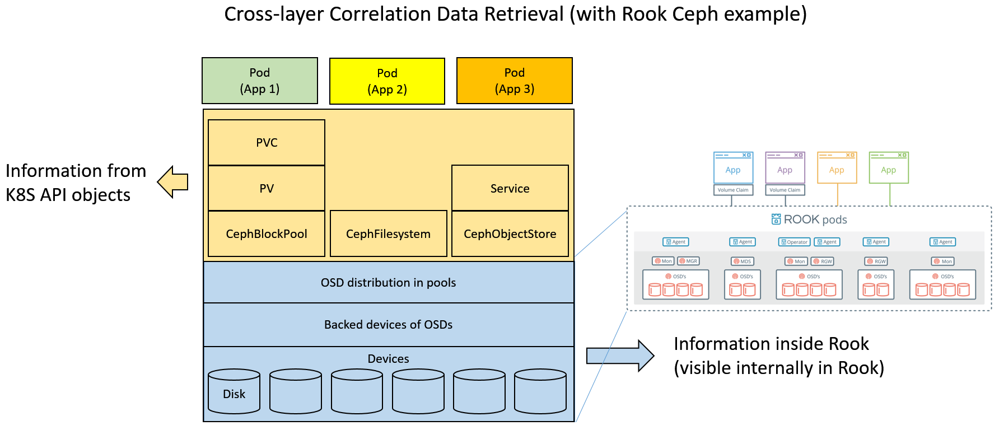

# Correlation Analysis

Kubernetes provides abstraction of resources such as cpu, memory and storage as levels of API objects. Pods (application) request these resources in terms of their purposes and leave the underlying hardware orchestration and resource provisioning to network, containers, and storage orchestrators. Therefore it is important to know whether or not pods are shareing the same hardware especially when the shared resource is going to be offline or predicted failed. Admins can schedule a pod evacuation and give applications some grace periods to switch their services which are much better than the failures actually happen and doing some recoveries.

**Correlation Analysis** tries to address this issue and provide correlation information that how applications are conneted to each others in the angle of shared resources.

## What correlation data is collected

Correlation exists at where hardware resources are shared. The following figure illustrates what data are collected with Rook's ceph example. In a ceph environment orchestrated by Rook, it provides three ways for pods to access the ceph cluster:
- block devices,  
    Pods request a volume through *PersistentVolumeClaim* objects. Kubernetes will lookup the backed *storageclass* for storage provisioning. Then the ceph pool(Specified in a *CephBlockPool* CRD object) that behinds this storageclass provides this space. **As for the ceph OSD devices that are behind this pool, it needs to go into Rook for how the pool is composed**.
- filesystem and  
    Pods request a volume with *flexvolume* directives. Kubernetes will lookup the backed ceph pool(specified in a *CephFilesystem* CRD object) for storage provisioning. And similiarly, it needs to **go into Rook for how the pool is composed**.
- object storages.  
    Pods access the object storage through a network service. It needs to look for IP in the service requests to know which pod is accessing the object storage. And as for what OSDs compose the pool that behinds the object storage service, it needs to **go into Rook**.

## How data are correlated

(#help_wanted)
